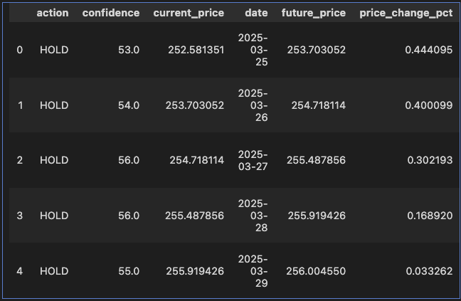
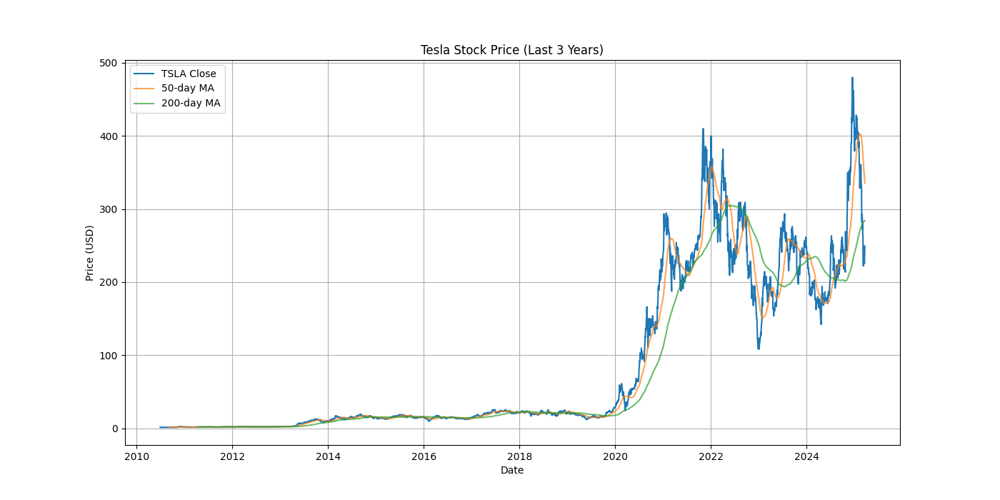

# sofe4620u-tsla-stock-prediction

Tesla Stock Prediction using PyTorch Machine Learning

## Authors

Group 6

- Emily Lai - 100825007
- Jeremy Mark Tubongbanua - 100849092
- Natasha Naorem - 100845321

## How to Run It

1. Ensure you have all dependencies specified in cell 2.

2. Open [./TSLA_v2.ipynb](./TSLA_v2.ipynb) in Jupyter Notebook.

3. Change the date according to the date you want to predict. (e.g. changing `prediction_date` = `2025-03-25` means you want to predict if you should HOLD, BUY, or SELL Tesla stock on March 25, 2025).

4. Run all of the cells.

## Sample Training Output

```sh
Training new model...
Random Forest Accuracy: 0.7082
              precision    recall  f1-score   support

           0       0.25      0.05      0.08        84
           1       0.73      0.84      0.78       354
           2       0.70      0.74      0.72       292

    accuracy                           0.71       730
   macro avg       0.56      0.54      0.53       730
weighted avg       0.66      0.71      0.68       730

Model saved to tesla_rf_model.joblib
```

## Sample Prediction

```sh
Prediction for 2024-03-25: BUY (Confidence: 77.00%)
Current price: $172.63
Future price (after 5 days): $166.63
Price change: -3.48%
Incorrect recommendation: BUY - The price actually decreased by 3.48%.
Death Cross: Short-term SMA ($172.65) below Long-term SMA ($179.68) - Bearish signal

Key features influencing this prediction:
- Return_50: 0.0317
- RSI_50: 0.0310
- Distance_Upper_Band_50: 0.0303
- Return_20: 0.0300
- Distance_Lower_Band_50: 0.0295
```

## Sample Prediction for March 24-29, 2025



### Training the Model

If you do not want to use the pre-trained model, you can train the model yourself by deleting `tesla_rf_model.joblib` and then running all of the cells.

## How It Works

We used Yahoo Finance to fetch Tesla stock data from 2010-06-29 to 2021-03-25. We then used PyTorch to create a neural network model to predict if you should HOLD, BUY, or SELL Tesla stock on a given date.


